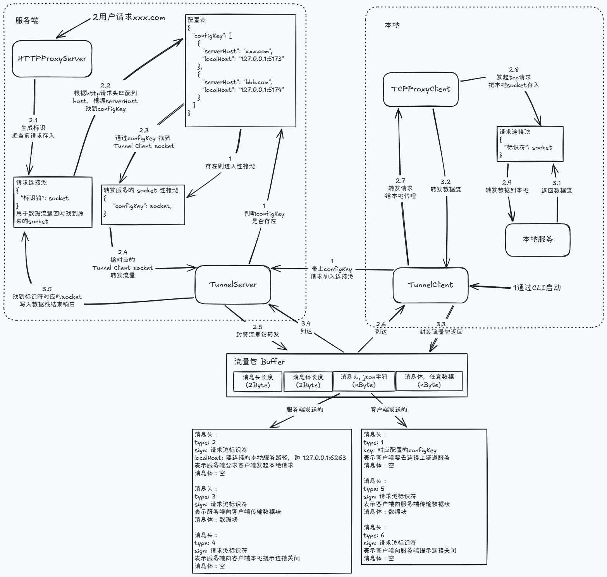

<h1 align="center">Ying Tunnel</h1>

### 简介

这是一个使用 ts 和 nodejs 实现的内网穿透服务与连接客户端，所有代码都在此仓库并以 pnpm 的 workspace 去管理，目前是基于 tcp 实现了 http 流量的代理。

### 使用方式

在服务器中安装 `ying-tunnel-server` 的 docker-compose 示例。

```yml
version: '3'

services:
  ying-tunnel-server:
    image: jackying007/ying-tunnel-server
    container_name: ying-tunnel-server
    ports:
      - '5859:5859'
      - '4948:4948'
      - '80:80'
    environment:
      - TUNNEL_SERVER_HOST=服务器ip或域名
      - TUNNEL_SERVER_PORT=4948
      - PROXY_SERVER_PORT=80
      - ADMIN_API_PORT=5859
      - ADMIN_PASSWORD=123456
```

启动后打开 `ADMIN_API_PORT` 端口的后台管理服务，输入 `ADMIN_PASSWORD` 登录，配置好要转发的线上地址和本地地址，然后按照提示下载终端工具，复制对应的 key 进行连接即可。

```bash
pnpm i @ying-tunnel/cli -g
ying-tunnel <要连接的服务ip或域名> <要连接的服务端口> <对应的key>
```

### 架构图



### 服务打包与本地启动

```bash
docker build --tag ying-tunnel-server:test --target server-runner .
```

```bash
docker run --name ying-tunnel-server -d \
  -p 5859:5859 \
  -p 4948:4948 \
  -p 80:80 \
  -e TUNNEL_SERVER_HOST=127.0.0.1 \
  -e TUNNEL_SERVER_PORT=4948 \
  -e PROXY_SERVER_PORT=80 \
  -e ADMIN_API_PORT=5859 \
  -e ADMIN_PASSWORD=123456 \
  ying-tunnel-server:test
```

### 发布 packages

```bash
pnpm build:pkgs
```

```bash
pnpm changeset
pnpm changeset version
pnpm changeset publish
```
