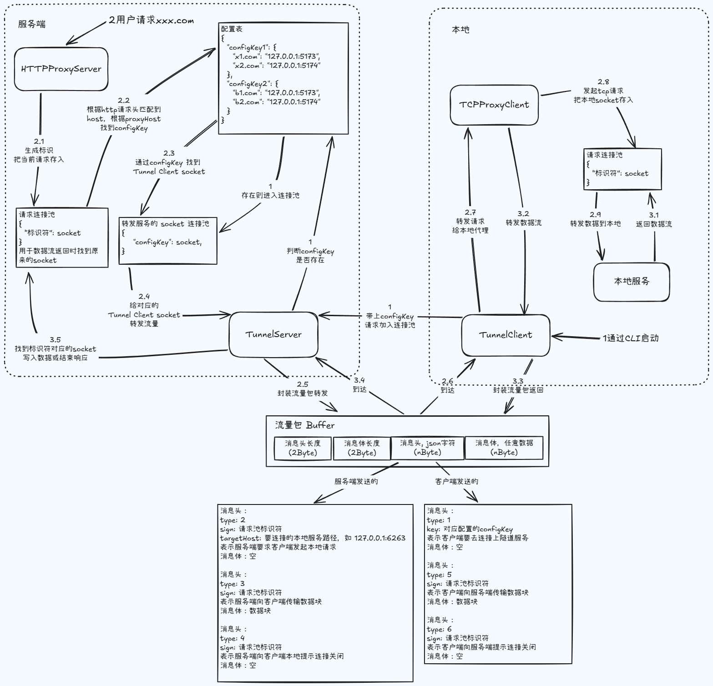

<h1 align="center">Ying Tunnel</h1>

# 简介

这是一个使用 Typescript 实现的内网穿透服务与连接客户端 CLI，核心模块包零依赖，基于 tcp 实现了 http 流量的代理。

## 使用方式

在服务器中安装 `ying-tunnel-server` 的 docker-compose 示例。

```yml
version: '3'

services:
  ying-tunnel-server:
    image: jackying007/ying-tunnel-server
    container_name: ying-tunnel-server
    ports:
      - '5859:5859'
      - '4948:4948'
      - '80:80'
    environment:
      - TUNNEL_SERVER_HOST=服务器ip或域名
      - TUNNEL_SERVER_PORT=4948
      - PROXY_SERVER_PORT=80
      - ADMIN_API_PORT=5859
      - ADMIN_PASSWORD=123456
```

启动后打开 `ADMIN_API_PORT` 端口的后台管理服务，输入 `ADMIN_PASSWORD` 登录，配置好要转发的线上地址和本地地址，然后按照提示下载终端工具，复制对应的 key 进行连接即可。

```bash
bun i @ying-tunnel/cli -g
ying-tunnel <要连接的服务ip或域名> <要连接的服务端口> <对应的key>
```

## 架构图



## 开始模式启动

安装依赖

```bash
bun i
```

启动核心库的开发模式，把产物编译出来，其他应用需要依赖它们。

```bash
bun dev:pkgs
```

启动所有应用

```bash
bun dev:apps
```

默认情况下 `@ying-tunnel/server` 需要监听80端口，如果bun没有权限，需要开启权限。

```bash
sudo setcap 'cap_net_bind_service=+ep' $(which bun)
```

启动一个测试的服务

```bash
bun dev:test-server
```

访问 `example.localhost`，请求将转发到测试的服务，访问成功则代表整个应用启动成功。

## 本地 docker 服务打包与启动

```bash
bun build:apps
cp -r apps/admin/dist/* apps/server/static/
bun compile:server
```

```bash
docker build --platform linux/amd64 --target server --tag ying-tunnel-server:test .
```

```bash
docker run --name ying-tunnel-server -d \
  -p 5859:5859 \
  -p 4948:4948 \
  -p 80:80 \
  -e TUNNEL_SERVER_HOST=127.0.0.1 \
  -e TUNNEL_SERVER_PORT=4948 \
  -e PROXY_SERVER_PORT=80 \
  -e ADMIN_API_PORT=5859 \
  -e ADMIN_PASSWORD=123456 \
  ying-tunnel-server:test
```

## 发布 packages

```bash
bun build:pkgs
bun build:apps
```

```bash
bun changeset
bun changeset version
```

不要执行 `bun changeset publish`，在 bun 下将无法解析 `workspace:*`，发布出去无法使用。

需要进入每个需要发布的包，执行命令

```bash
bun publish
```
